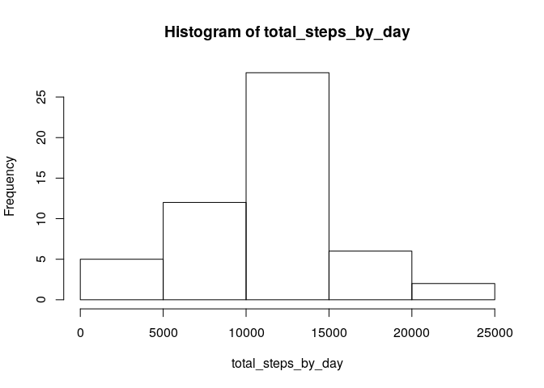
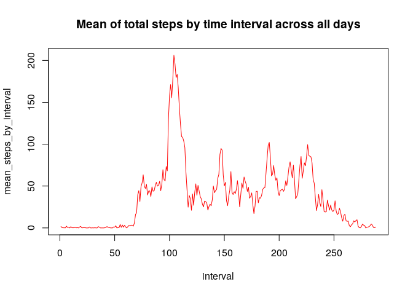
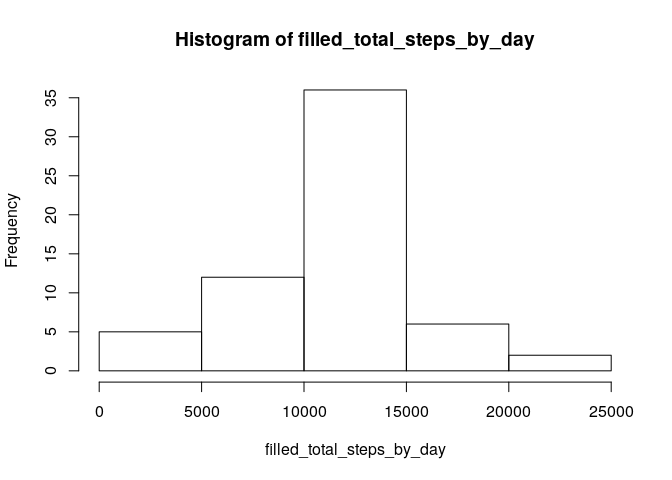
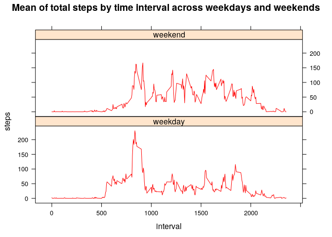

## Loading and preprocessing data

This R Markdown document is part of the coursera "Reproducible Reasearch" course assignment.
The aim is to present results of the analysis of data from ...
Let's read the data and look at the few first lines :

```r
raw_data <- read.csv(file="./Data/activity.csv", header=TRUE, sep = ",", na.strings = "NA")
head(raw_data)
```

```
##   steps       date interval
## 1    NA 2012-10-01        0
## 2    NA 2012-10-01        5
## 3    NA 2012-10-01       10
## 4    NA 2012-10-01       15
## 5    NA 2012-10-01       20
## 6    NA 2012-10-01       25
```
The file was read properly and we see it contains missing values represented as "NA". 
Let's clean this up.

```r
proc_data <- raw_data[complete.cases(raw_data),]
proc_data <- droplevels(proc_data); # this is simply to get rid of empty levels after we removed NA values
head(proc_data)
```

```
##     steps       date interval
## 289     0 2012-10-02        0
## 290     0 2012-10-02        5
## 291     0 2012-10-02       10
## 292     0 2012-10-02       15
## 293     0 2012-10-02       20
## 294     0 2012-10-02       25
```

## What is mean total number of steps taken per day?
Moving on to the first question. But before, let's plot the histogram of total steps.

```r
total_steps_by_day <- tapply(proc_data$steps,proc_data$date,sum)
hist(total_steps_by_day)
```

<!-- -->


```r
mean_steps_by_day <- mean(total_steps_by_day)
median_steps_by_day <- median(total_steps_by_day)
```
So the mean of total steps per day is 10766.1886792 steps and the median is 10765.


## What is the average daily activity pattern?
Now, let's look at mean of total steps by interval accross all days.

```r
mean_steps_by_interval <- tapply(proc_data$steps,proc_data$interval,mean)
plot(mean_steps_by_interval,type='l',col='red', xlab = "interval", main="Mean of total steps by time interval across all days")
```

<!-- -->

As you can see in the plot above, maximum number of steps is reached around interval 100.

## Imputing missing values
We saw earlier that there are a number of days/intervals where there are missing values (coded as "NA"). 
Let's find out wether removing them introduced bias into our calculations.

```r
na_nbr <- nrow(raw_data[is.na(raw_data),])
total_nbr <- nrow(raw_data)
ratio <- na_nbr/total_nbr
```
If we go back to our raw data, we find there are 2304 missing rows out of 17568 entries. This represents nearly 13.1147541 %.

We will use **the mean for that 5-minute interval** to fill in our data.

```r
fill_data <- raw_data[is.na(raw_data),c('interval','date')]
intervals = unique(raw_data$interval)
df <- data.frame(cbind(intervals,mean_steps_by_interval))
names(df) <- c('interval','steps')
filled_data <- merge(fill_data,df,by='interval')
filled_data <- rbind(filled_data,proc_data)
filled_data <- filled_data[order(filled_data$date,filled_data$interval),]
nbr_filled_row <- nrow(filled_data)
nbr_raw_row <- nrow(raw_data)
head(filled_data)
```

```
##    interval       date     steps
## 1         0 2012-10-01 1.7169811
## 10        5 2012-10-01 0.3396226
## 17       10 2012-10-01 0.1320755
## 29       15 2012-10-01 0.1509434
## 33       20 2012-10-01 0.0754717
## 45       25 2012-10-01 2.0943396
```

The filled dataframe contains 17568 rows, same as the raw dataframe (17568).
Here's the histogram of total steps by day from filled data.  We notice a little change in frequencies as the central range rose to a higher value while neighboring ranges went a little down.
This result is somehow expected as we corrected missing data with the mean values for each interval and therefore we introduced more data points around the mean value.

```r
filled_total_steps_by_day <- tapply(filled_data$steps,filled_data$date,sum)
hist(filled_total_steps_by_day)
```

<!-- -->
Let's calculate the mean and median using the filled dataframe and see how different they are compared to previous calculations.

```r
filled_total_steps_by_day <- tapply(filled_data$steps,filled_data$date,sum)
filled_mean_steps_by_day <- mean(filled_total_steps_by_day)
filled_median_steps_by_day <- median(filled_total_steps_by_day)
```

item   | raw data              | filled data
-      |  -                    |-
mean   | 10766.1886792 | 10766.1886792
median | 10765| 10766.1886792
-      |  -                    |-

Only difference observed is for the median, which is equal to the mean for the filled data.

## Are there differences in activity patterns between weekdays and weekends?
In order to analyze patterns over weekdays, let's add a new column to the dataset where we indicate “weekday” and “weekend” depending on corresponding date.

```r
filled_data$date <- as.Date(filled_data$date)
is_weekend <- function(y) {
        if (weekdays(y) == "samedi" | weekdays(y) == "dimanche") {"weekend"}
        else {"weekday"}
}
filled_data$weekend <- (sapply(filled_data$date,is_weekend))
head(filled_data)
```

```
##    interval       date     steps weekend
## 1         0 2012-10-01 1.7169811 weekday
## 10        5 2012-10-01 0.3396226 weekday
## 17       10 2012-10-01 0.1320755 weekday
## 29       15 2012-10-01 0.1509434 weekday
## 33       20 2012-10-01 0.0754717 weekday
## 45       25 2012-10-01 2.0943396 weekday
```

Now that we have our additional information (weekday or weekend), let's see how average steps by interval overs weekdays vs weekends campares.

```r
library(lattice)
d = aggregate(filled_data$steps, by=list(interval = filled_data$interval, weekend = filled_data$weekend), mean)
names(d) = c('interval', 'weekend', 'steps') 
xyplot(steps~interval|weekend,data=d,type='l',col='red',
        main="Mean of total steps by time interval across weekdays and weekends",layout=c(1,2))
```

<!-- -->

The weekend steps plot seems to reflect various activities as we can see several peaks on the curve.
The weekday steps plot shows a different profil as it contains two major peaks: around interval 800 (probably due to morning activity and going to work) and around 1800 or 1900 (probably return home).
Note that in both plots, intervals up to 500 have no activity at all, probably reprensenting sleeping hours.
